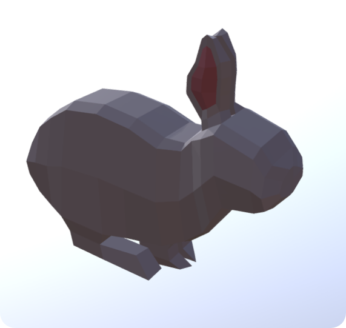
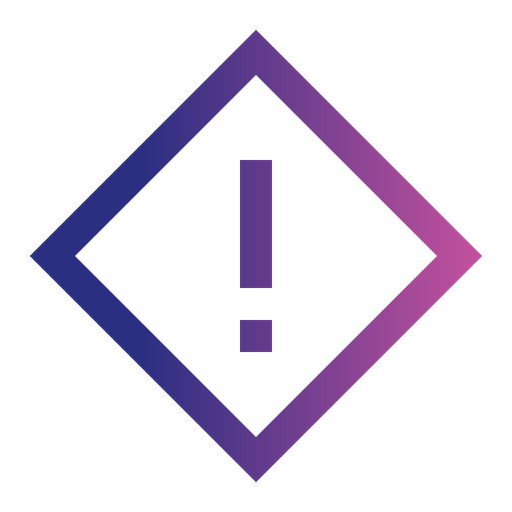

<html>
    <link rel="stylesheet" href="https://maxcdn.bootstrapcdn.com/bootstrap/3.4.1/css/bootstrap.min.css">
    
    
    
    <head>
        <meta charset="UTF-8">
        <meta name="keywords" content="Yun's Projects, Yun Tao, Yun Tao's Projects">
        <meta name="description" content="Don't mind me, this is just a website for my projects">
        <meta name="viewport" content="width=device-width, initial-scale=1.0">
        <title>Yun's Projects</title>
        <h5 class="fade-in base">
            Projects list
        </h5>
        <h4 class="fade-in base">
            Yun Tao
        </h4>       

        

        

            
            <b class="cornersBase"> 
                Descending Dungeons 
                Programming Language: Java 
                IDE: Intellij (Java) LIBGDX extension 
                Art Program: Asesprite 
                Application Link: <a href="https://docs.google.com/document/d/1-NaynmWokK7eVWDVENhJRUXXmPNuBNWEi6wyLfAZwZ0/edit?usp=sharing" class="color">Link</a>  
                Showcase Video: <a href="https://drive.google.com/file/d/19wOt4qFzCiBrGTeKLnV4ZN0TDIlk6eTQ/view?usp=sharing" class="color">
                    Link</a> 
            </b>
        
  
    

        

           
            <b class="cornersBase"> The Purifiers 
            Programming Language: Java 
            IDE: Intellij (Java) LIBGDX extension 
            Art Program: Photoshop 
            App Link: <a href="https://play.google.com/store/apps/details?id=com.projectgrapes.game&hl=en&gl=US" class="color">Link</a>  
            Github Link: <a href="https://github.com/Y83Tao/Purifiers" class="color">Link</a>  
            
            </b>
        

         

           
            <b class="cornersBase"> Padoru Website 
            Programming Languages: Javascript, Html, Css 
            Frameworks: Node.js, Express.js, BCrypt.js, Bootstrap 
            IDE: Visual Sutdio Code 
            Website Link: <a href="https://pad0ru.herokuapp.com/" class="color">Link</a>  
            
            </b>
        

        

             
            <b class="cornersBase"> Eco Sim 
            Programming Language: Java 
            IDE: Intellij (Java) LIBGDX extension 
            School Culminating 
            Application Link: 
            Showcase Video: <a href="https://drive.google.com/file/d/1zYhXG49GHMNKVyOAMOMbmWzalxpW9zU6/view?usp=sharing" class="color">Link</a>
             
            </b>
        
  
   

        

              
            <b class="cornersBase"> The Negotiator 
            Programming Language: C# 
            IDE: Unity Game Engine 
            Work In Progress 
            Application Link: --- 
            Showcase Video: ---    
            </b>

        
  

    </head>

    

</html>
