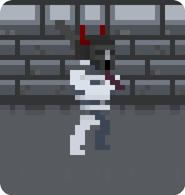

<html>
    
    
    <head>
        <meta charset="UTF-8">
        <meta name="keywords" content="Yun's Projects, Yun Tao, Yun Tao's Projects">
        <meta name="description" content="Don't mind me, this is just a website for my projects">
        <meta name="viewport" content="width=device-width, initial-scale=1.0">
        <h1>
        
        </h1><h2></h2>
        <title>Yun's Projects</title>
        <h5 class="fade-in base">
            Projects list
            <h6 class="fade-in base">Yun Tao</h6> 
        </h5>

        

            
        
  
        
Descending Dungeons 
            Programming Language: Java 
            IDE: Intellij (Java) LIBGDX extension 
            Art Program: Asesprite 
            Application Link: <a href="https://docs.google.com/document/d/1-NaynmWokK7eVWDVENhJRUXXmPNuBNWEi6wyLfAZwZ0/edit?usp=sharing" class="color">
                Link</a>  
            Showcase Video: <a href="https://drive.google.com/file/d/19wOt4qFzCiBrGTeKLnV4ZN0TDIlk6eTQ/view?usp=sharing" class="color">
                Link</a> 
        

        

            
        

        
 The Purifiers 
            Programming Language: Java 
            IDE: Intellij (Java) LIBGDX extension 
            Art Program: Photoshop 
            App Link: <a href="https://play.google.com/store/apps/details?id=com.projectgrapes.game&hl=en&gl=US" class="color">Link</a>  
            
        

        

              
        
  
        
Eco Sim 
            Programming Language: Java 
            IDE: Intellij (Java) LIBGDX extension 
            School Culminating 
            Application Link: 
            Showcase Video: <a href="https://drive.google.com/file/d/1zYhXG49GHMNKVyOAMOMbmWzalxpW9zU6/view?usp=sharing" class="color">Link</a>
             
        

        

              
        
  
        
Python Dungeon Crawler 
            Programming Language: Python 
            IDE: PyCharm 
            Github Link: --- 
        

        

              
        
  
        
The Negotiator 
            Programming Language: C# 
            IDE: Unity Game Engine 
            Work In Progress 
            Application Link: --- 
            Showcase Video: ---    
        

    </head>

    

</html>
